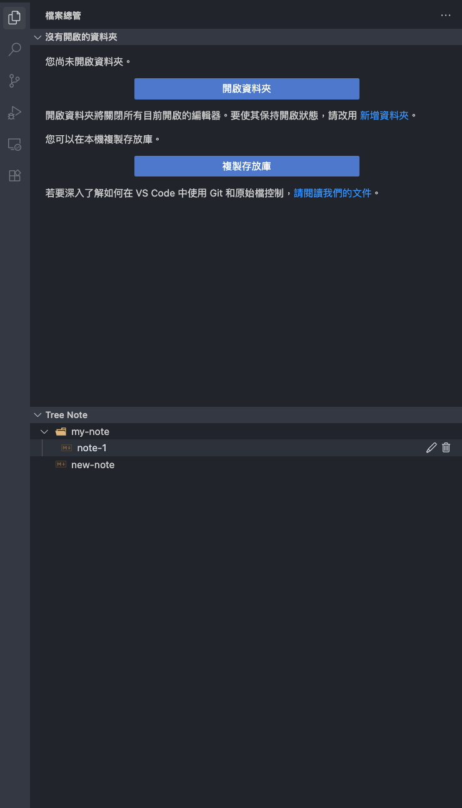
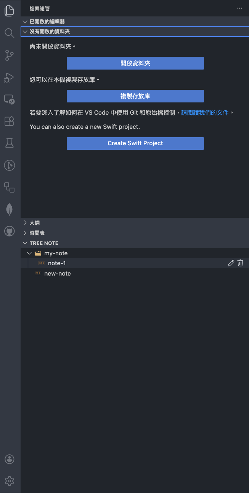

[中文版](#tree-note) | [English](#tree-note-english)

# Tree Note

> 💡 **提示**：現在您可以透過內建的 **GitHub Gist 同步功能**，在不同的 IDE 或裝置之間輕鬆同步筆記。

**Tree Note** 是一款為 VS Code、Antigravity、Cursor...等,量身打造的層級式筆記管理擴充功能。它讓您可以輕鬆組織 Markdown 筆記，提供如原生檔案總管般流暢的樹狀導覽體驗。

### Tree Note 位置

|                     Antigravity                      |                   VS Code                   |
| :--------------------------------------------------: | :-----------------------------------------: |
|  |  |

## ✨ 主要特色

### 1. 層級式筆記結構

- **清晰的目錄管理**：支援資料夾與 Markdown 筆記的層級式排列，讓您的筆記結構一目了然。
- **直觀導覽**：您可以自由建立、組織並切換不同的筆記與資料夾。

### 2. 雲端同步 (GitHub Gist)

- **多裝置同步**：透過您的 GitHub Gist，輕鬆在不同電腦或不同 IDE (VS Code, Cursor, Antigravity...) 之間同步筆記。
- **隱私安全**：預設僅支援使用 GitHub **Secret Gist**，確保您的筆記內容只有您自己可以存取。
- **智慧衝突管理**：當多個裝置同時修改同一份筆記時，系統會自動建立「衝突副本」，確保資料絕對不會被覆蓋或遺失。
- **無縫體驗**：登入 GitHub 帳號後，系統會自動處理上傳與下載，讓您專注於寫作。

### 3. 強大的樹狀操作

- **快速新增**：一鍵新增根目錄或子層級的筆記與資料夾。
- **自動展開**：建立新項目後，系統會自動展開父資料夾，確保您能立即看到結果。
- **全域控制**：支援標題列的一鍵「全部展開」與「全部縮合」功能。

### 4. 安全與資料誠信

- **智慧刪除確認**：刪除資料夾時，會顯示清晰的樹狀預覽（最多顯示 3 個項目），分層呈現即將被移除的內容，防止誤刪。
- **輸入驗證系統**：

  - 自動修剪（Trim）名稱前後的空白。
  - 即時阻擋非法字元（如 `/ \ : * ? " < > |`）。
  - 禁止建立以 `.` 開頭的隱藏檔案，確保檔案管理的一致性。

### 5. 深度限制

- 預設支援最高 **3 層** 的資料夾深度，協助您保持筆記結構的簡潔與可讀性，避免過度嵌套。

## 🚀 快速上手

1. **安裝套件**：在 VS Code、Antigravity、Cursor...etc 等,中載入本擴充功能。
2. **開啟檢視器**：在側邊欄「檔案總管 (Explorer)」下方找到「Tree Note」區塊。
3. **管理筆記**：
   - 使用標題列的圖示與新增文件或資料夾開始建立結構。
   - 資料存放路徑固定於 IDE 的全域儲存目錄中，確保您的筆記在不同專案間都能持續存取。
4. **雲端同步**：
   - 點擊標題列的「Sync to GitHub Gist」圖示（雲端上傳圖示）。
   - 依照提示登入您的 GitHub 帳號。
   - 選擇「Create New GitHub Secret Gist」建立新同步，或輸入現有的 Gist ID 進行連結。
   - 若要中斷同步，點擊「Disconnect Cloud」圖示（登出圖示）即可。

您可以在 IDE 的全域儲存目錄中找到 `notes-data` 資料夾。

# Tree Note (English)

> 💡 **Tip**: You can now easily sync your notes across different IDEs or devices using the built-in **GitHub Gist Sync** feature.

**Tree Note** is a hierarchical note-taking extension tailored for VS Code, Antigravity, Cursor...etc. It allows you to easily organize your Markdown notes, providing a smooth tree-like navigation experience similar to the native file explorer.

### Tree Note Locations

|                     Antigravity                      |                   VS Code                   |
| :--------------------------------------------------: | :-----------------------------------------: |
|  |  |

## ✨ Key Features

### 1. Hierarchical Note Structure

- **Clear Organization**: Support for a tree-like hierarchy of folders and Markdown notes, making your structure easy to understand.
- **Intuitive Navigation**: Easily create, organize, and navigate through your notes and folders.

### 2. Cloud Sync (GitHub Gist)

- **Multi-Device Sync**: Easily sync your notes across different computers or IDEs (VS Code, Cursor, Antigravity...) via your GitHub Gist.
- **Privacy & Security**: Supports GitHub **Secret Gist** by default, ensuring your notes remain private and accessibles only to you.
- **Smart Conflict Management**: Automatically creates "Conflict Copies" when multiple devices modify the same note, ensuring no data is ever lost or overwritten.
- **Seamless Experience**: Once signed in with GitHub, the system handles uploads and downloads automatically, letting you focus on writing.

### 3. Powerful Tree Operations

- **Quick Creation**: Add root-level or nested notes and folders with a single click.
- **Auto-Expansion**: After creating a new item, the system automatically expands the parent folder to provide immediate visual feedback.
- **Global Control**: Supports one-click "Expand All" and "Collapse All" functionality from the title bar.

### 4. Safety & Data Integrity

- **Smart Delete Confirmation**: When deleting folders, a clear tree preview (up to 3 items) is shown to display the hierarchy of contents being removed, preventing accidental data loss.
- **Input Validation System**:
  - Automatic trimming of leading and trailing whitespace.
  - Real-time blocking of illegal characters (e.g., `/ \ : * ? " < > |`).
  - Prohibition of hidden files (starting with `.`) to ensure consistent file management.

### 5. Depth Limitation

- Supports a maximum folder depth of **3 layers** by default, helping you keep your note structure clean, readable, and avoiding over-nesting.

## 🚀 Getting Started

1. **Install the Extension**: Load this extension in VS Code, Antigravity, Cursor...etc.
2. **Open the View**: Find the "Tree Note" section at the bottom of the "Explorer" sidebar.
3. **Manage Notes**:
   - Use the icons in the title bar to start building your structure.
   - All data is stored in your IDE's global storage directory, ensuring your notes persist across different workspaces.
4. **Cloud Sync**:
   - Click the "Sync to GitHub Gist" icon (cloud upload icon) in the title bar.
   - Follow the prompts to sign in with your GitHub account.
   - Choose "Create New GitHub Secret Gist" or enter an existing Gist ID to connect.
   - To stop syncing, click the "Disconnect Cloud" icon (sign-out icon).

You can find the `notes-data` folder within your IDE's global storage directory.
